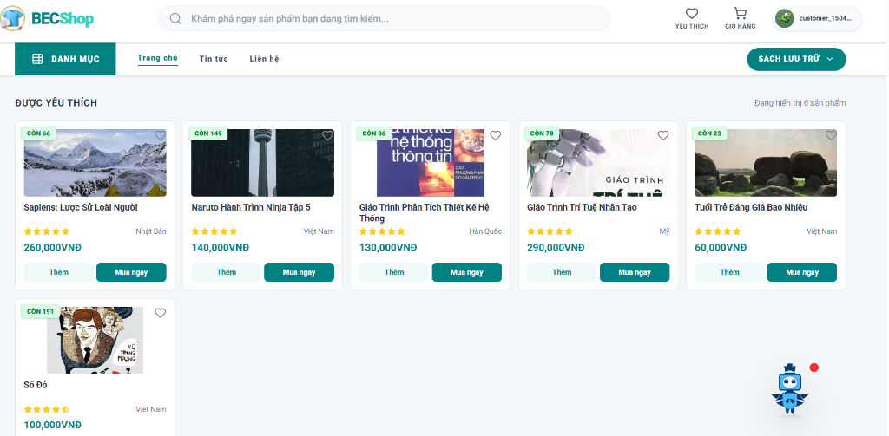
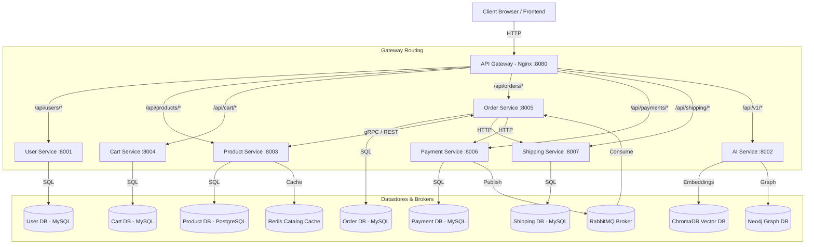

# E-Commerce Microservices Platform

A robust, enterprise-grade e-commerce application designed following a distributed microservices architecture. It consists of multiple independent, specialized services coordinating through synchronous REST/gRPC protocols and asynchronous event-driven messages.

---

## Screenshots & AI Chatbot

Here is a preview of the BECShop application user interface and the AI-powered chatbot assistant:

| Homepage (Book Store Showcase) | AI Chatbot Assistant (Becper) |
| :---: | :---: |
|  |  |

---

## 1. System Architecture

The following diagram visualizes the overall system routing flow, databases, caching layers, and message broker integrations:



---

## 2. Tech Stack & Port Directory

| Service Name | Primary Language | Framework | Database / Cache / Broker | Host Port |
| :--- | :--- | :--- | :--- | :--- |
| **Frontend** | TypeScript | React + Vite + Tailwind | Browser LocalStorage | `3000` |
| **API Gateway** | Nginx Conf | Nginx | - | `8080` |
| **User Service** | Python 3.10+ | Django + DRF | MySQL 8.0 | `8001` |
| **Product Service**| Python 3.10+ | Django + DRF | PostgreSQL 15 + Redis | `8003` |
| **Cart Service** | Python 3.10+ | Django + DRF | MySQL 8.0 + Redis | `8004` |
| **Order Service** | Python 3.10+ | Django + DRF | MySQL 8.0 + RabbitMQ + gRPC | `8005` |
| **Payment Service**| Python 3.10+ | Django + DRF | MySQL 8.0 + RabbitMQ | `8006` |
| **Shipping Service**| Python 3.10+ | Django + DRF | MySQL 8.0 | `8007` |
| **AI Service** | Python 3.10+ | FastAPI | ChromaDB + Neo4j + OpenAI GPT | `8002` |

---

## 3. Monorepo Project Structure

This repository is structured as a monorepo, where each sub-folder represents an independent service containing its own configuration and documentation:

- **[`frontend/`](frontend/README.md):** Client-facing interface and internal administrative portal.
- **[`api-gateway/`](api-gateway/README.md):** Reverse proxy gateway distributing network traffic.
- **[`user-service/`](user-service/README.md):** Accounts, permissions (RBAC), and profile management. [OpenAPI Spec](user-service/docs/openapi.yaml).
- **[`product-service/`](product-service/README.md):** Catalog indexes, categories hierarchy, and stock reservation. [OpenAPI Spec](product-service/docs/openapi.yaml).
- **[`cart-service/`](cart-service/README.md):** Shopper carts and price calculations. [OpenAPI Spec](cart-service/docs/openapi.yaml).
- **[`order-service/`](order-service/README.md):** Order checkouts, lifecycle orchestration, and payments callback routing. [OpenAPI Spec](order-service/docs/openapi.yaml).
- **[`payment-service/`](payment-service/README.md):** Financial payment methods, transactions, and VietQR generation. [OpenAPI Spec](payment-service/docs/openapi.yaml).
- **[`shipping-service/`](shipping-service/README.md):** Delivery carriers, shipping speeds, and transit logs. [OpenAPI Spec](shipping-service/docs/openapi.yaml).
- **[`ai-service/`](ai-service/README.md):** Vector similarity search, knowledge graphs, and LLM chat. [OpenAPI Spec](ai-service/docs/openapi.yaml).

---

## 4. Key Architectural Highlights

1. **Distributed Stock Reservation:**
   - Prevents double-selling/overselling by initiating temporary PENDING stock reservations during checkout.
   - Subtracted from physical stock upon confirmation of payment, or restored if checkout times out or fails.
2. **Event-Driven Payment Updates:**
   - Real-time transaction state synchronization via RabbitMQ message queues.
3. **Internal Microservice Authentication:**
   - Internal endpoints are locked down and require valid `X-Service-Token` headers to authorize inter-service communication.
4. **Defensive Error Handling:**
   - Validates inputs early in the frontend and at upstream gateway levels to prevent cascading failure scenarios.

---

## 5. Non-Functional Requirements (NFRs)

The platform is designed and optimized based on the following non-functional benchmarks:

- **Scalability & High Availability:**
  - Services are completely stateless, enabling horizontal scaling under an Nginx load balancer.
  - Failures in non-core services (e.g., AI Service chatbot) do not block core transactional flows (e.g., Cart and Order placement).
- **Latency & Performance:**
  - Utilizes Redis cache for database query offloading of homepage catalogs and item details.
  - Employs low-latency RPC pathways (gRPC) for real-time inventory validation checks.
- **Reliability & Event Consistency:**
  - Guarantees eventual consistency for checkout and payments using RabbitMQ AMQP messaging retries.
  - Implements defensive transaction isolation levels on MySQL/PostgreSQL databases to prevent dirty reads.
- **Security & Vulnerability Mitigation:**
  - Standardizes OAuth2 JWT access tokens (60-minute lifetime) and refresh tokens (7-day blacklisted blackhole) for client sessions.
  - Enforces internal RPC authorization locks (`X-Service-Token`) to block unauthorized cross-network access.
- **Resource Constraints:**
  - Configures explicit container memory reservations (e.g., 256MB) and hard limits (e.g., 512MB/2.5GB) in Docker Compose configurations to prevent Out-Of-Memory (OOM) host crashes.

---

## 6. Quick Start (Local Setup)

### 6.1. Prerequisites
- Docker & Docker Compose
- Node.js (only if running the frontend locally without containers)

### 6.2. Running the Platform
To spin up all services, database instances, brokers, and the gateway automatically, run from the root directory:

```bash
./run.sh up
```

Alternatively, run using Docker Compose directly:
```bash
docker compose -f infrastructure/docker-compose.yml up -d
```

### 6.3. Tracking Logs
To stream logs across the entire ecosystem:
```bash
./run.sh logs
```

Or target a specific service:
```bash
docker compose -f infrastructure/docker-compose.yml logs -f <service-name>
```

### 6.4. Stopping the System
```bash
./run.sh down
```

---

## Copyright

This project was researched and developed by **Hana** for learning, technical demonstration, and interviewing purposes.
