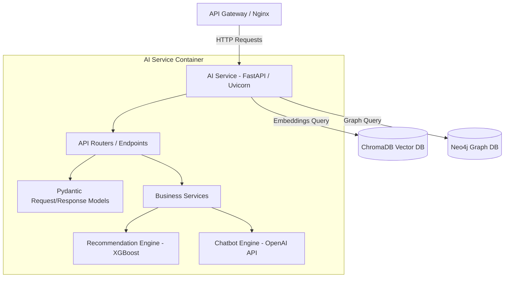

# AI Service

The AI Service provides smart recommendations, query parsing, product matching, and interactive chatbot assistants using vector databases and LLM frameworks.

---

## 1. Tech Stack

- **Language:** Python 3.10+
- **Framework:** FastAPI & Uvicorn
- **Vector Database:** ChromaDB (for storing product description and catalog embeddings)
- **Knowledge Graph Database:** Neo4j (for mapping complex relations between categories, products, and brands)
- **Machine Learning & NLP Libraries:** 
  - `sentence-transformers` & `transformers` (embedding generation)
  - `openai` (for conversational LLM prompting)
  - `scikit-learn` & `xgboost` (for recommendation score ranking)
  - `pandas` & `numpy` (data preprocessing)

---

## 2. System Design

### 2.1. Core Features & Responsibilities

The AI Service handles the following core functionalities:

- **Vector-based Search & Similarity:**
  - Uses ChromaDB to index semantic representations of products.
  - Matches user search queries to candidate products via cosine similarity embedding lookups.
- **Graph-based Category Navigation:**
  - Uses Neo4j to store and traverse knowledge graphs linking categories, publishers, and items.
- **Personalized Recommendations:**
  - Utilizes XGBoost and Scikit-Learn models to score candidate products based on historical browsing actions and category preferences.
- **Conversational Chatbot Assistant:**
  - FastAPI chatbot endpoint powered by OpenAI GPT APIs.
  - Understands and answers customer shopping questions while recommending specific product IDs mapped out from semantic vector queries.

---

### 2.2. Component Diagram

The internal structure of the AI Service is designed following a layered architecture:



---

### 2.3. Data Model

The AI Service leverages non-relational database schemas for high-speed indexing.

#### ChromaDB (Vector Index Schema)
- **Collection Name:** `products`
- **Metadata Fields:** `id`, `name`, `price`, `category`, `brand`
- **Vector Dimensions:** 384 (using `all-MiniLM-L6-v2` SentenceTransformer embeddings)

#### Neo4j (Knowledge Graph Nodes & Relationships)
- **Nodes:**
  - `(:Category {name: String})`
  - `(:Brand {name: String})`
  - `(:Product {id: String, name: String})`
- **Relations:**
  - `(:Product)-[:BELONGS_TO]->(:Category)`
  - `(:Product)-[:MANUFACTURED_BY]->(:Brand)`

---

## 3. API Specification

All request endpoints, request body structure, response schemas, and authorization levels for AI Service are documented separately:

👉 **[OpenAPI Spec - YAML (docs/openapi.yaml)](docs/openapi.yaml)**

---

## 4. Administration & Operation

### 4.1. Vector Database Seeding

The AI Service supports automatic synchronization and database build tasks:

#### Method 1: Automatic Sync on Container Startup
Inside `docker-compose.yml`, the environment variable `AI_SEED_ON_STARTUP=1` is preset for the `ai-service` container. It automatically triggers `sync_chroma.py` and `scripts/create_kb_graph.py` to index candidates and graphs on launch.

#### Method 2: Manual Run
Execute the synchronization script manually inside the docker container:
```bash
docker compose -f infrastructure/docker-compose.yml exec ai-service python sync_chroma.py
```

---

### 4.2. Viewing Logs

To track application behavior, model predictions, or runtime errors in the AI Service, run from the repository root:

```bash
docker compose -f infrastructure/docker-compose.yml logs -f ai-service
```

---

## Copyright

This project was researched and developed by **Hana** for learning, technical demonstration, and interviewing purposes.
