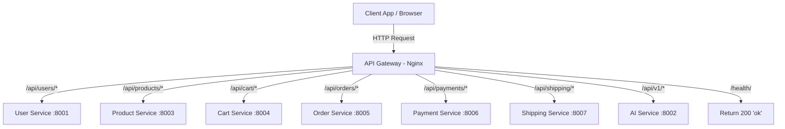

# API Gateway

The API Gateway acts as the single entry point for all client applications, routing incoming HTTP traffic dynamically to the correct downstream microservice based on URL path rules.

---

## 1. Tech Stack

- **Server:** Nginx (Alpine-based Docker Image)
- **Role:** Reverse Proxy, Load Balancer, and Routing Gateway

---

## 2. System Design

### 2.1. Core Features & Responsibilities

The API Gateway handles the following core gateway functionalities:

- **Path-based Routing:**
  - Routes traffic prefixed with `/api/users/` to the **User Service**.
  - Routes traffic prefixed with `/api/products/` or `/api/categories/` to the **Product Service**.
  - Routes traffic prefixed with `/api/cart/` to the **Cart Service**.
  - Routes traffic prefixed with `/api/orders/` to the **Order Service**.
  - Routes traffic prefixed with `/api/payments/` to the **Payment Service**.
  - Routes traffic prefixed with `/api/shipping/` to the **Shipping Service**.
  - Routes traffic prefixed with `/api/v1/chatbot` or `/api/v1/recommend` to the **AI Service**.
- **Request Buffering & Limit Control:**
  - Standardizes maximum request payload sizes (`client_max_body_size 20M`) to support image/media uploads.
- **Unified Health Checking:**
  - Exposes `/health/` returning a 200 HTTP code used by Docker Compose orchestration healthchecks.

---

### 2.2. Routing Architecture

The flowchart below visualizes how the API Gateway redirects traffic down to specific microservices:



---

## 3. Configuration Layout

The configuration is structured cleanly within the `nginx` directory:
- `nginx.conf`: Defines main worker processes, logs formatting, max connection limits, and base server listening port (`8000` mapping to docker host port `8080`).
- `conf.d/`: Individual modular service configurations:
  - `user-service.conf`
  - `product-service.conf`
  - `cart-service.conf`
  - `order-service.conf`
  - `payment-service.conf`
  - `shipping-service.conf`
  - `ai-service.conf`

---

## 4. Administration & Operation

### 4.1. Viewing Gateway Logs

To inspect access logs (source IP, requested route, HTTP status code response) or upstream errors, run from the repository root:

```bash
docker compose -f infrastructure/docker-compose.yml logs -f api-gateway
```

---

## Copyright

This project was researched and developed by **Hana** for learning, technical demonstration, and interviewing purposes.
