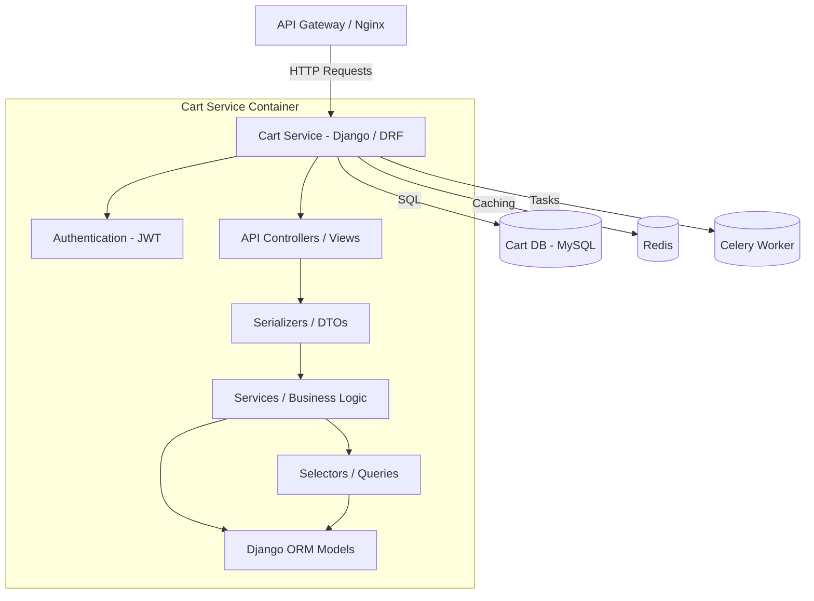
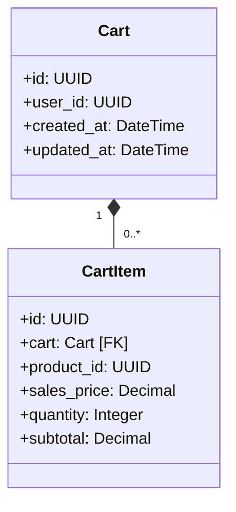

# Cart Service

The Cart Service manages user shopping carts, items within carts, quantity adjustments, and pricing aggregation.

---

## 1. Tech Stack

- **Language:** Python 3.10+
- **Framework:** Django 4.2+ & Django REST Framework (DRF) 3.15+
- **Database:** MySQL 8.0 (via `PyMySQL` driver)
- **Caching & Caching Backend:** Redis (via `django-redis` client)
- **Task Runner:** Celery (for asynchronous operations)

---

## 2. System Design

### 2.1. Core Features & Responsibilities

The Cart Service handles the following core functionalities:

- **Cart Lifecycle Management:**
  - Create and retrieve active shopping carts bound to customer UUIDs.
- **Cart Operations:**
  - Add items with specified pricing snapshots.
  - Dynamically update item quantities inside the active cart.
  - Remove items from carts.
- **Pricing Computation:**
  - Compute subtotals and aggregates on the fly based on active items' sales prices and quantities.

---

### 2.2. Component Diagram

The internal structure of the Cart Service is designed following a layered architecture:



---

### 2.3. Class Diagram

The domain model classes in Cart Service:



---

### 2.4. Data Model

The database is built on MySQL with dedicated cart transactional tables.

#### Table `carts` (Shopping Cart Metadata)
| Field | Data Type | Constraint | Description |
| :--- | :--- | :--- | :--- |
| `id` | UUID (char(36)) | Primary Key | Cart identifier |
| `user_id` | UUID (char(36)) | Not Null, Index | Cart owner's UUID |
| `created_at` | datetime | Auto Now Add | Creation timestamp |
| `updated_at` | datetime | Auto Now | Update timestamp |

#### Table `cart_items` (Cart Items mapping)
| Field | Data Type | Constraint | Description |
| :--- | :--- | :--- | :--- |
| `id` | UUID (char(36)) | Primary Key | Item identifier |
| `cart_id` | UUID (char(36)) | FK (`carts.id`), Cascade | Associated Cart |
| `product_id` | UUID (char(36)) | Not Null, Index | Product reference ID |
| `sales_price` | decimal(12,2) | Not Null | Unit sales price |
| `quantity` | integer | Not Null, Default: 1 | Item count |

---

## 3. API Specification

All request endpoints, request body structure, response schemas, and authorization levels for Cart Service are documented separately:

👉 **[OpenAPI Spec - YAML (docs/openapi.yaml)](docs/openapi.yaml)**

---

## 4. Administration & Operation

### 4.1. Viewing Logs

To track application behavior, SQL queries, or runtime errors in the Cart Service, run from the repository root:

```bash
docker compose -f infrastructure/docker-compose.yml logs -f cart-service
```

To view the database container logs (`cart-db`):
```bash
docker compose -f infrastructure/docker-compose.yml logs -f cart-db
```

---

## Copyright

This project was researched and developed by **Hana** for learning, technical demonstration, and interviewing purposes.
