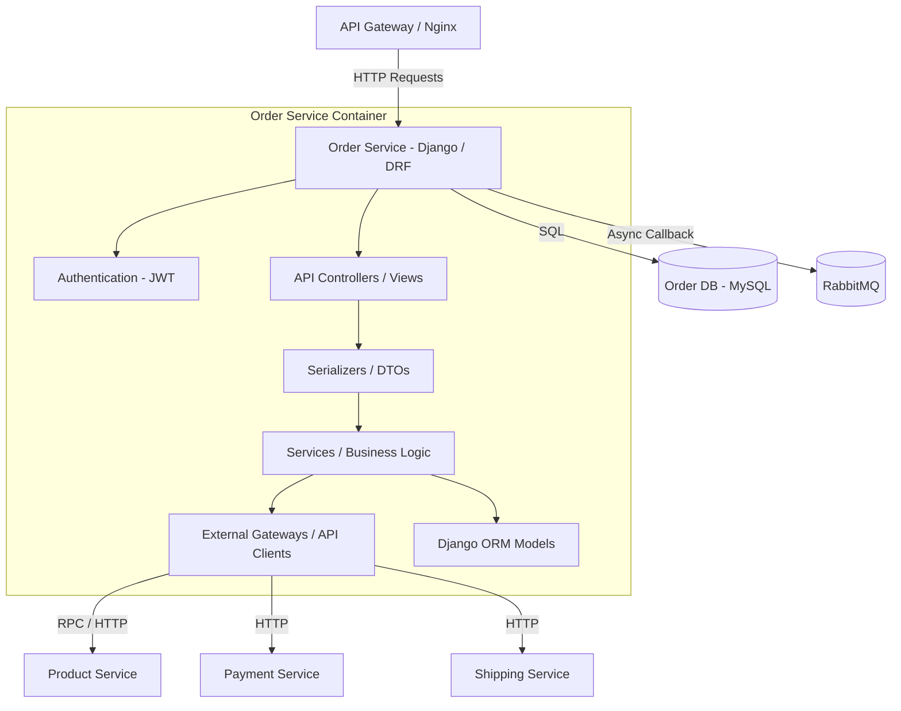
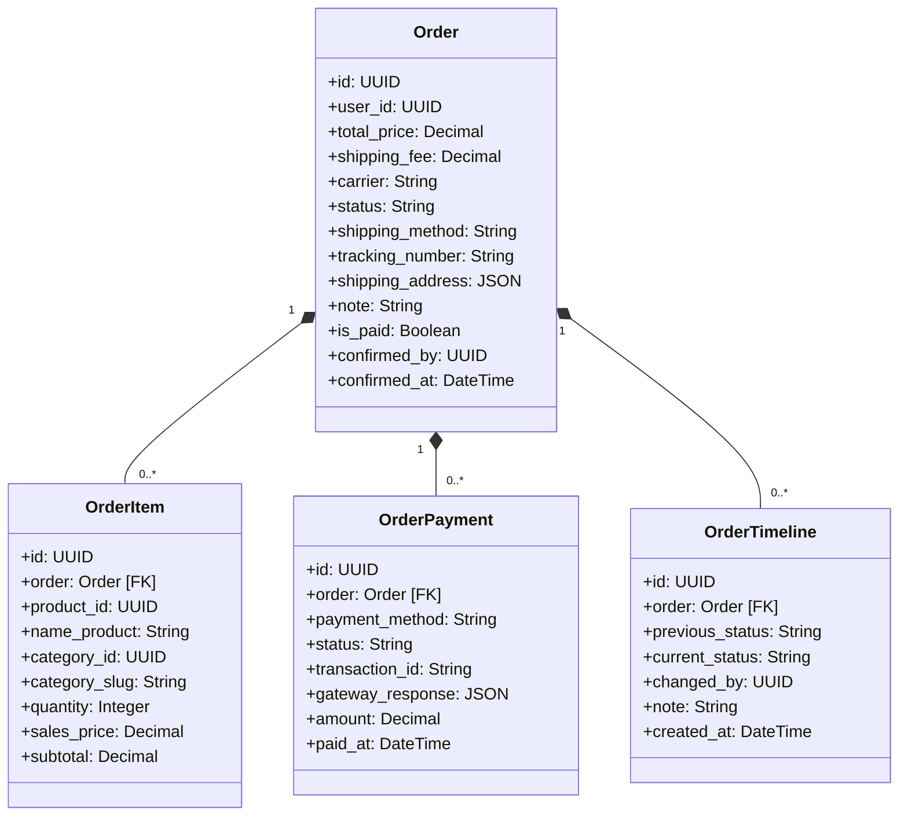

# Order Service

The Order Service handles checkout initialization, order items state transitions, payment integration, shipment coordination, and order history tracking.

---

## 1. Tech Stack

- **Language:** Python 3.10+
- **Framework:** Django 4.2+ & Django REST Framework (DRF) 3.15+
- **Database:** MySQL 8.0
- **Message Broker:** RabbitMQ / AMQP (via `pika` library for listening to payment callbacks asynchronously)
- **RPC Framework:** gRPC (via `grpcio` for low-latency communications)

---

## 2. System Design

### 2.1. Core Features & Responsibilities

The Order Service handles the following core functionalities:

- **Order Creation & Verification:**
  - Validates user addresses and shipping method parameters.
  - Interacts with Product Service to perform temporary inventory holds (stock reservations).
  - Processes pricing totals (products subtotal + shipping fees).
- **Checkout Flow Orchestration:**
  - Integrates with the Payment Service to kick off payment gateways.
  - Maintains state synchronization between orders, payments, and shipping updates.
- **Timeline & Transaction Auditing:**
  - Audits order changes in detail (status transitions from `PENDING` to `PROCESSING`, `SHIPPED`, `COMPLETED`, or `CANCELLED`).
  - Records historic transactions with detailed snapshots of product properties, prices, and categories.
- **Asynchronous Event Consuming:**
  - Listens to payment completion events via RabbitMQ exchanges.
  - Triggers automatic status progression (e.g., confirming shipping and final inventory subtractions) upon payment success.

---

### 2.2. Component Diagram

The internal structure of the Order Service is designed following a layered architecture:



---

### 2.3. Class Diagram

The domain models mapped inside Order Service:



---

### 2.4. Data Model

The database is built on MySQL with dedicated transactional and audit trail tables.

#### Table `orders` (Order Metadata)
| Field | Data Type | Constraint | Description |
| :--- | :--- | :--- | :--- |
| `id` | UUID (char(36)) | Primary Key | Order identifier |
| `user_id` | UUID (char(36)) | Not Null, Index | Customer who created the order |
| `total_price` | decimal(15,2) | Not Null, Index | Grand total price |
| `shipping_fee`| decimal(12,2) | Not Null, Default: 0 | Shipping cost |
| `status` | varchar(20) | Choices: `PENDING`, `PROCESSING`, `SHIPPED`, `COMPLETED`, `CANCELLED` | General order status |
| `shipping_method`| varchar(30) | Choices: `STANDARD`, `EXPRESS` | Selected carrier speed |
| `tracking_number`| varchar(100)| Nullable | Tracking number |
| `shipping_address`| json | Not Null | Address details snapshot |
| `is_paid` | boolean | Default: `False` | Has order been paid |

#### Table `order_items` (Order Product Details Snapshot)
| Field | Data Type | Constraint | Description |
| :--- | :--- | :--- | :--- |
| `id` | UUID (char(36)) | Primary Key | Order Item identifier |
| `order_id` | UUID (char(36)) | FK (`orders.id`), Cascade | Associated Order |
| `product_id` | UUID (char(36)) | Not Null, Index | Product ID |
| `name_product`| varchar(255) | Nullable | Product name snapshot |
| `quantity` | integer | Not Null | Purchased count |
| `sales_price` | decimal(12,2) | Not Null | Unit price at checkout |

---

## 3. API Specification

All request endpoints, request body structure, response schemas, and authorization levels for Order Service are documented separately:

👉 **[OpenAPI Spec - YAML (docs/openapi.yaml)](docs/openapi.yaml)**

---

## 4. Administration & Operation

### 4.1. Database Seeding

The Order Service supports database seeding for demo orders:

#### Method 1: Direct Docker Compose Exec
Run the Django management command directly inside the active container:
```bash
docker compose -f infrastructure/docker-compose.yml exec order-service python manage.py seed_orders
```

---

### 4.2. Viewing Logs

To track application behavior, SQL queries, or runtime errors in the Order Service, run from the repository root:

```bash
docker compose -f infrastructure/docker-compose.yml logs -f order-service
```

To view the database container logs (`order-db`):
```bash
docker compose -f infrastructure/docker-compose.yml logs -f order-db
```

---

## Copyright

This project was researched and developed by **Hana** for learning, technical demonstration, and interviewing purposes.
