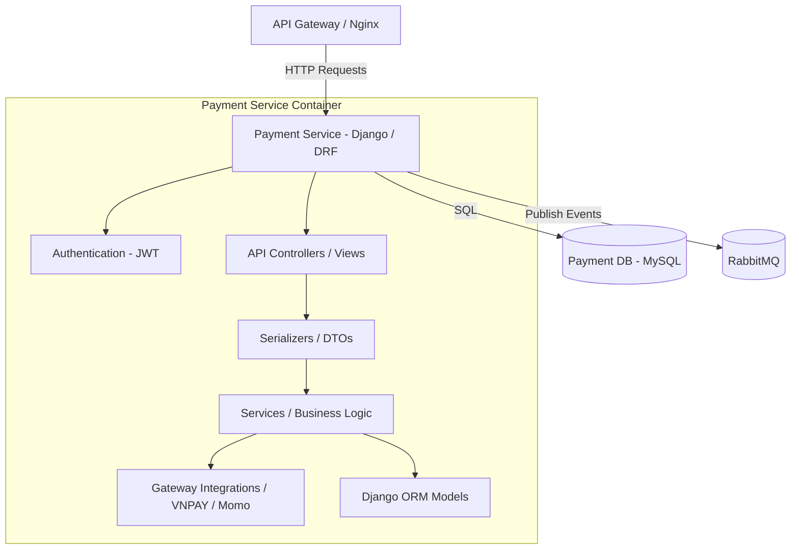
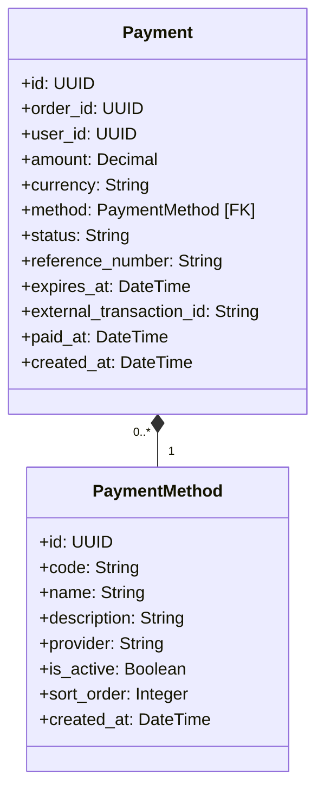

# Payment Service

The Payment Service manages payment methods, processes transactions, generates payment QRs, handles third-party webhooks, and publishes transaction updates asynchronously.

---

## 1. Tech Stack

- **Language:** Python 3.10+
- **Framework:** Django 4.2+ & Django REST Framework (DRF) 3.15+
- **Database:** MySQL 8.0
- **Message Broker:** RabbitMQ / AMQP (via `pika` to publish payment success events)

---

## 2. System Design

### 2.1. Core Features & Responsibilities

The Payment Service handles the following core functionalities:

- **Payment Methods Management:**
  - Maintains availability, ordering, and configuration profiles for payment methods (e.g., COD, Bank Transfer, VNPAY).
- **Transaction Initialization:**
  - Generates a checkout reference and expiration window for order checkout links/URLs.
- **Integration & QRs:**
  - Integrates third-party checkout URLs and payment QR payloads (VietQR).
- **Payment Lifecycle & Webhooks:**
  - Receives asynchronous API notifications (webhooks) from external payment gateways.
  - Updates the payment status (`PENDING` -> `COMPLETED` / `FAILED` / `REFUNDED`).
- **Asynchronous Broadcasting:**
  - Broadcasts payment status updates (e.g., payment success) to RabbitMQ exchanges to let order processing services (e.g., Order Service) progress automatically.

---

### 2.2. Component Diagram

The internal structure of the Payment Service is designed following a layered architecture:



---

### 2.3. Class Diagram

The domain model classes in Payment Service:



---

### 2.4. Data Model

The database is built on MySQL with dedicated payment and transactional history tables.

#### Table `payment_methods` (Supported Payment Configurations)
| Field | Data Type | Constraint | Description |
| :--- | :--- | :--- | :--- |
| `id` | UUID (char(36)) | Primary Key | Method identifier |
| `code` | varchar(30) | Unique, Not Null | Unique payment code (VNPAY, COD, etc.) |
| `name` | varchar(100) | Not Null | Display name |
| `description`| varchar(255) | Default: '' | Method details |
| `is_active` | boolean | Default: `True` | Method availability |

#### Table `payments` (Transaction Register)
| Field | Data Type | Constraint | Description |
| :--- | :--- | :--- | :--- |
| `id` | UUID (char(36)) | Primary Key | Payment identifier |
| `order_id` | UUID (char(36)) | Not Null, Index | Reference to External Order |
| `user_id` | UUID (char(36)) | Not Null, Index | Reference to Customer |
| `amount` | decimal(15,2) | Not Null | Transaction total |
| `method_id` | UUID (char(36)) | FK (`payment_methods.id`) | Chosen payment method |
| `status` | varchar(20) | Choices: `PENDING`, `PROCESSING`, `COMPLETED`, `FAILED`, `REFUNDED` | Transaction status |
| `reference_number`| varchar(100)| Unique, Index | Gateway identifier |
| `expires_at` | datetime | Nullable | Payment window expiry |
| `external_transaction_id`| varchar(100)| Nullable | Gateway transaction reference |

---

## 3. API Specification

All request endpoints, request body structure, response schemas, and authorization levels for Payment Service are documented separately:

👉 **[OpenAPI Spec - YAML (docs/openapi.yaml)](docs/openapi.yaml)**

---

## 4. Administration & Operation

### 4.1. Viewing Logs

To track application behavior, SQL queries, or runtime errors in the Payment Service, run from the repository root:

```bash
docker compose -f infrastructure/docker-compose.yml logs -f payment-service
```

To view the database container logs (`payment-db`):
```bash
docker compose -f infrastructure/docker-compose.yml logs -f payment-db
```

---

## Copyright

This project was researched and developed by **Hana** for learning, technical demonstration, and interviewing purposes.
