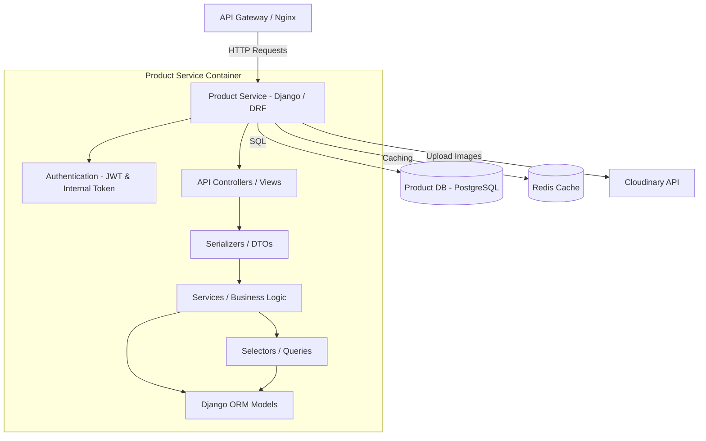
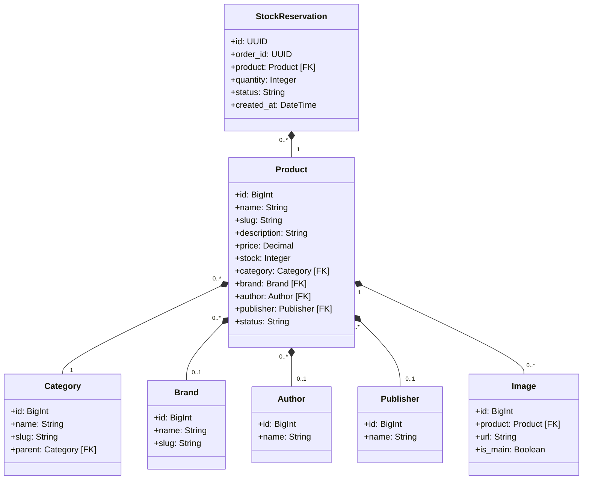

# Product Service

The Product Service manages categories, brands, publishers, authors, products, inventory control, and stock reservations to prevent overselling.

---

## 1. Tech Stack

- **Language:** Python 3.10+
- **Framework:** Django 4.2+ & Django REST Framework (DRF) 3.15+
- **Database:** PostgreSQL 15
- **Caching & Session Storage:** Redis (via `django-redis` for catalog and product caching)
- **Media Storage:** Cloudinary (for storing product catalog photos)

---

## 2. System Design

### 2.1. Core Features & Responsibilities

The Product Service handles the following core functionalities:

- **Catalog & Categories Directory:**
  - Multi-level nested product categories (Category Tree Structure).
  - Extended metadata mapping including Brands, Authors, and Publishers.
- **Product Management:**
  - Detailed product attributes: pricing, stock counts, dimensions, origin, descriptions, and media assets.
  - Image galleries associated with products (integrated with Cloudinary).
- **Advanced Query & Filters:**
  - Full-text search and complex filtering (by category, brand, price ranges, publisher, author).
  - Homepage endpoint with Redis-cached featured and latest products list.
- **Stock Reservation (Inventory Control):**
  - Temporary stock holding (Reservation) when checkout starts (`PENDING` status) to avoid overselling.
  - Hard subtraction of physical stock upon reservation confirmation (`CONFIRMED` status) after successful payment.
  - Expiry/rollback of expired reservations.
- **Security & Microservice Isolation:**
  - Standard User authentication (JWT verification) alongside Internal API authentication using `X-Service-Token` headers for inter-service RPC calls (e.g., from Order Service).

---

### 2.2. Component Diagram

The internal structure of the Product Service is designed following a layered architecture:



---

### 2.3. Class Diagram

The domain model classes in Product Service are structured around Clean Architecture layers:



---

### 2.4. Data Model

The database is built on PostgreSQL with foreign keys mapping metadata models to products.

#### Table `infrastructure_product` (Product Catalog)
| Field | Data Type | Constraint | Description |
| :--- | :--- | :--- | :--- |
| `id` | BigInt | Primary Key | Auto-increment ID |
| `name` | varchar(255) | Not Null | Product title |
| `slug` | varchar(255) | Unique, Not Null | URL slug |
| `description` | text | Nullable | Detailed description |
| `price` | decimal(10,2) | Not Null | Retail price |
| `stock` | integer | Not Null | Available stock quantity |
| `category_id` | BigInt | FK (`infrastructure_category.id`) | Assigned category |
| `brand_id` | BigInt | FK (`infrastructure_brand.id`), Nullable | Manufacturer brand |
| `author_id` | BigInt | FK (`infrastructure_author.id`), Nullable | Book author (if applicable) |
| `publisher_id` | BigInt | FK (`infrastructure_publisher.id`), Nullable | Publisher (if applicable) |
| `status` | varchar(20) | Choices: `NEW`, `SELLING`, `OUT_OF_STOCK`, `DISCONTINUED` | Current sell status |

#### Table `infrastructure_stockreservation` (Inventory Holding)
| Field | Data Type | Constraint | Description |
| :--- | :--- | :--- | :--- |
| `id` | UUID (char(36)) | Primary Key | Auto-generated UUID |
| `order_id` | UUID (char(36)) | Not Null | External Order ID |
| `product_id` | BigInt | FK (`infrastructure_product.id`) | Reserved product |
| `quantity` | integer | Not Null | Quantity held |
| `status` | varchar(20) | Choices: `PENDING`, `CONFIRMED`, `CANCELLED` | Reservation status |
| `created_at` | datetime | Auto Now Add | Expiry tracking |

---

## 3. API Specification

All request endpoints, request body structure, response schemas, and authorization levels for Product Service are documented separately:

👉 **[OpenAPI Spec - YAML (docs/openapi.yaml)](docs/openapi.yaml)**

---

## 4. Administration & Operation

### 4.1. Database Seeding

The Product Service supports database seeding for products and categories:

#### Method 1: Automatic Seeding on Startup
Inside `docker-compose.yml`, the environment variable `PRODUCT_SEED_ON_STARTUP=1` is preset for the `product-service` container. It automatically seeds categories and products during startup.

#### Method 2: Direct Docker Compose Exec
Run the Django management command directly inside the active container:
```bash
docker compose -f infrastructure/docker-compose.yml exec product-service python manage.py seed_products
```

---

### 4.2. Viewing Logs

To track application behavior, SQL queries, or runtime errors in the Product Service, run from the repository root:

```bash
docker compose -f infrastructure/docker-compose.yml logs -f product-service
```

To view the database container logs (`product-db`):
```bash
docker compose -f infrastructure/docker-compose.yml logs -f product-db
```

---

## Copyright

This project was researched and developed by **Hana** for learning, technical demonstration, and interviewing purposes.
