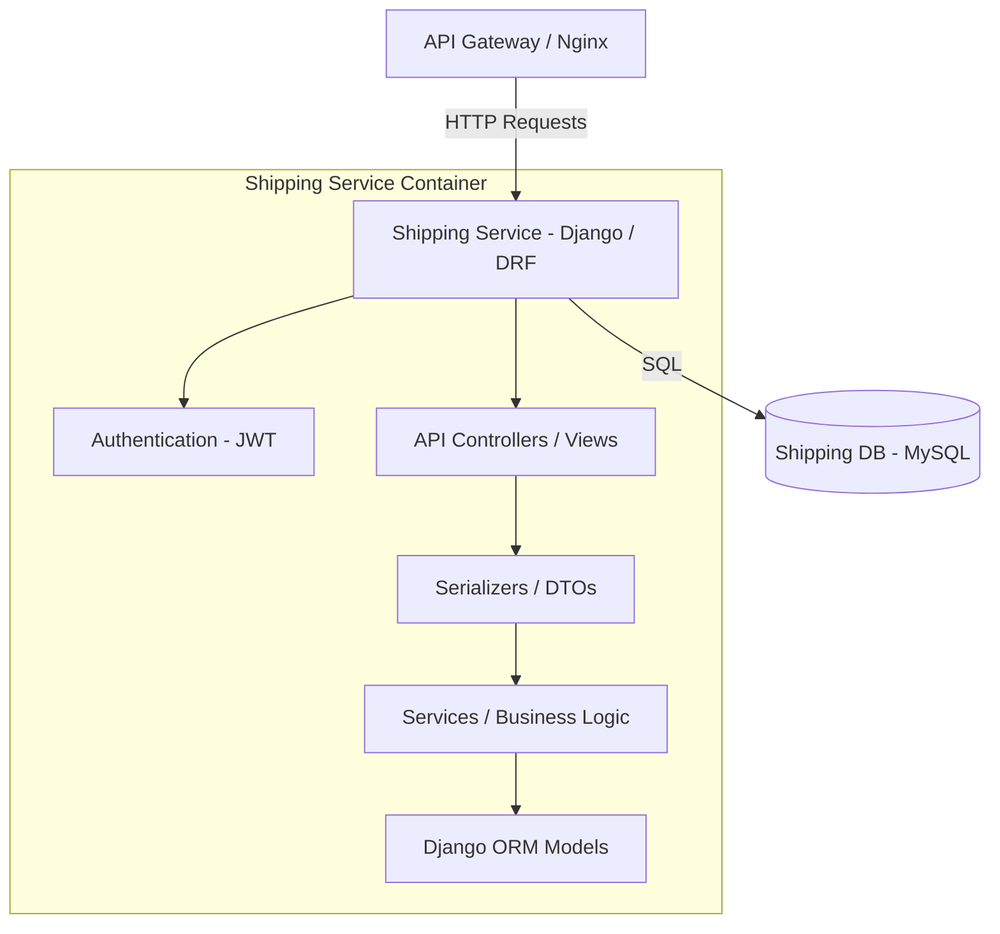
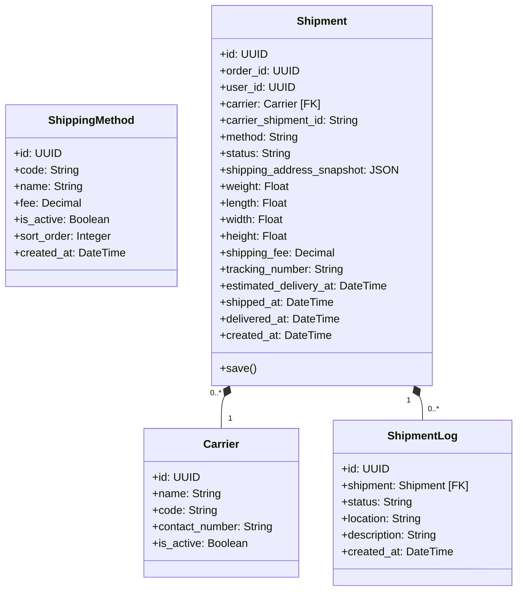

# Shipping Service

The Shipping Service manages shipping carriers, methods, logistics pricing, parcel dimensions, shipment tracking updates, and transit logs.

---

## 1. Tech Stack

- **Language:** Python 3.10+
- **Framework:** Django 4.2+ & Django REST Framework (DRF) 3.15+
- **Database:** MySQL 8.0

---

## 2. System Design

### 2.1. Core Features & Responsibilities

The Shipping Service handles the following core functionalities:

- **Carrier & Method Directory:**
  - Manages shipping partners (e.g., GHTK, GHN, Viettel Post) and speeds (STANDARD, EXPRESS).
  - Determines dynamic fee calculations mapped against selected shipping methods.
- **Shipment Processing:**
  - Registers new shipments bound to external Order IDs.
  - Captures shipping address snapshots to lock in transit paths.
  - Stores parcel specifications (weight, height, length, width).
- **Logistics Tracking:**
  - Generates shipping barcodes and tracking numbers.
  - Maintains transition logs (`ShipmentLog`) tracking package locations and status states (`PREPARING` -> `READY_FOR_PICKUP` -> `PICKED_UP` -> `IN_TRANSIT` -> `DELIVERED`).

---

### 2.2. Component Diagram

The internal structure of the Shipping Service is designed following a layered architecture:



---

### 2.3. Class Diagram

The domain model classes in Shipping Service:



---

### 2.4. Data Model

The database is built on MySQL with dedicated carrier and shipment history tables.

#### Table `shipping_methods` (Supported Speeds & Base Costs)
| Field | Data Type | Constraint | Description |
| :--- | :--- | :--- | :--- |
| `id` | UUID (char(36)) | Primary Key | Method identifier |
| `code` | varchar(20) | Unique, Not Null | Unique speed code (STANDARD, EXPRESS, etc.) |
| `name` | varchar(100) | Not Null | Display name |
| `fee` | decimal(12,2) | Default: 0.00 | Base cost |
| `is_active` | boolean | Default: `True` | Method status |

#### Table `carriers` (Logistics Providers Registry)
| Field | Data Type | Constraint | Description |
| :--- | :--- | :--- | :--- |
| `id` | UUID (char(36)) | Primary Key | Carrier identifier |
| `name` | varchar(100) | Not Null | Provider name (e.g., GHTK) |
| `code` | varchar(50) | Unique, Not Null | Code identifier |
| `is_active` | boolean | Default: `True` | Operator status |

#### Table `shipments` (Active Deliveries)
| Field | Data Type | Constraint | Description |
| :--- | :--- | :--- | :--- |
| `id` | UUID (char(36)) | Primary Key | Shipment identifier |
| `order_id` | UUID (char(36)) | Not Null, Index | Target Order reference |
| `user_id` | UUID (char(36)) | Not Null, Index | Customer reference |
| `carrier_id` | UUID (char(36)) | FK (`carriers.id`) | Assigned carrier |
| `status` | varchar(20) | Choices: `PREPARING`, `READY_FOR_PICKUP`, `DELIVERED`, etc. | Shipment phase |
| `tracking_number`| varchar(100)| Unique, Nullable | Carrier barcode |

---

## 3. API Specification

All request endpoints, request body structure, response schemas, and authorization levels for Shipping Service are documented separately:

👉 **[OpenAPI Spec - YAML (docs/openapi.yaml)](docs/openapi.yaml)**

---

## 4. Administration & Operation

### 4.1. Viewing Logs

To track application behavior, SQL queries, or runtime errors in the Shipping Service, run from the repository root:

```bash
docker compose -f infrastructure/docker-compose.yml logs -f shipping-service
```

To view the database container logs (`shipping-db`):
```bash
docker compose -f infrastructure/docker-compose.yml logs -f shipping-db
```

---

## Copyright

This project was researched and developed by **Hana** for learning, technical demonstration, and interviewing purposes.
