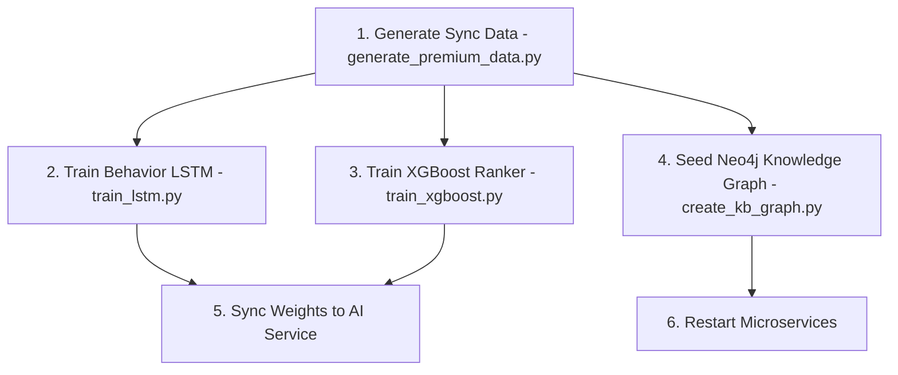

# AI Model Training & Synchronization Pipeline

This folder contains the complete pipeline for generating high-fidelity mock data, preparing datasets, training machine learning models, and synchronizing knowledge bases (Graph DB, Vector DB) for the E-commerce AI recommendation engine.

---

## 1. Pipeline Architecture & Models

The recommendation system uses a Hybrid Ranking Architecture combining:
1. **Behavior LSTM (Sequence Predictor):** Captures sequence patterns of user clicks, cart actions, and purchases to predict the next candidate product.
2. **XGBoost Ranker (Feature Ranker):** Scores candidate products based on static user attributes, category preferences, and item popularity.
3. **Neo4j Knowledge Graph:** Models structured relationships (`Category`, `Brand`, `Product`) to resolve context recommendations.
4. **ChromaDB Vector Store:** Enables semantic search (RAG) mapping customer search queries directly to catalog items.

---

## 2. Step-by-Step Execution Guide

Follow this sequence to refresh the data, train models, and update the microservices:



### Step 1: Generate Synchronized Synthetic Data
Generate realistic e-commerce categories (electronics, fashion, books), product items, and user behavior sessions following a marketing conversion funnel:
```bash
python generate_premium_data.py
```
* **Output:**
  - `artifacts/products.csv`: Synced product catalog.
  - Copies `products.csv` directly into seed directories of `product-service`.
  - `artifacts/user_behavior.csv`: User browsing history sequence logs.

---

### Step 2: Train the Behavior LSTM Model
Train a sequence-based PyTorch LSTM network to predict the next product ID a user is likely to interact with:
```bash
python train_lstm.py
```
* **Training details:**
  - Tokenizes product IDs.
  - Splits sequence logs into sliding window chunks (`window_size = 15`).
  - Trains for 15 epochs and exports model weights.
* **Output:**
  - `models/best_behavior_lstm.pth`: Trained weights file.
  - `models/vocab.pkl`: Encoded vocabulary mapping.
  - Automatically copies these files to `ai-service/models/` for hot reloading.

---

### Step 3: Train the XGBoost Ranker Model
Train a classification model to predict whether a customer will purchase a candidate product based on static and dynamic attributes:
```bash
python generate_xgboost_data.py
python train_xgboost.py
```
* **Output:**
  - `models/xgboost_ranker.model`: Serialized model file.
  - Automatically copies the model to `ai-service/models/`.

---

### Step 4: Populate the Neo4j Knowledge Graph
Seed relationship mappings into the Neo4j Graph database:
```bash
python create_kb_graph.py
```
* **Operations:**
  - Establishes `Category` nodes, `Brand` nodes, and `Product` nodes.
  - Creates relational links: `(:Product)-[:BELONGS_TO]->(:Category)` and `(:Product)-[:MANUFACTURED_BY]->(:Brand)`.

---

### Step 5: Synchronize Microservices Databases
Refresh Django databases to load the newly generated premium catalogs.

1. **Seed Product MySQL DB:**
   Go to the `product-service` directory and run:
   ```bash
   python manage.py seed_products --refresh
   ```
2. **Re-index ChromaDB Vector Store:**
   Go to the `ai-service` directory and run:
   ```bash
   python sync_chroma.py
   ```
3. **Restart the containers:**
   Go to the `infrastructure` directory and run:
   ```bash
   docker compose down && docker compose up -d
   ```

---

## 3. Directory Layout

- `artifacts/`: Input/output CSV datasets used in pipeline steps.
- `models/`: Exported model binaries and index dictionaries.
- `generate_premium_data.py`: High-fidelity synthetic data generator.
- `train_lstm.py`: PyTorch LSTM trainer.
- `generate_xgboost_data.py` / `train_xgboost.py`: XGBoost Ranker pipelines.
- `create_kb_graph.py`: Neo4j graph importer.
- `sync_chroma.py`: Vector database index builder.

---

## Copyright

This project was researched and developed by **Hana** for learning, technical demonstration, and interviewing purposes.
