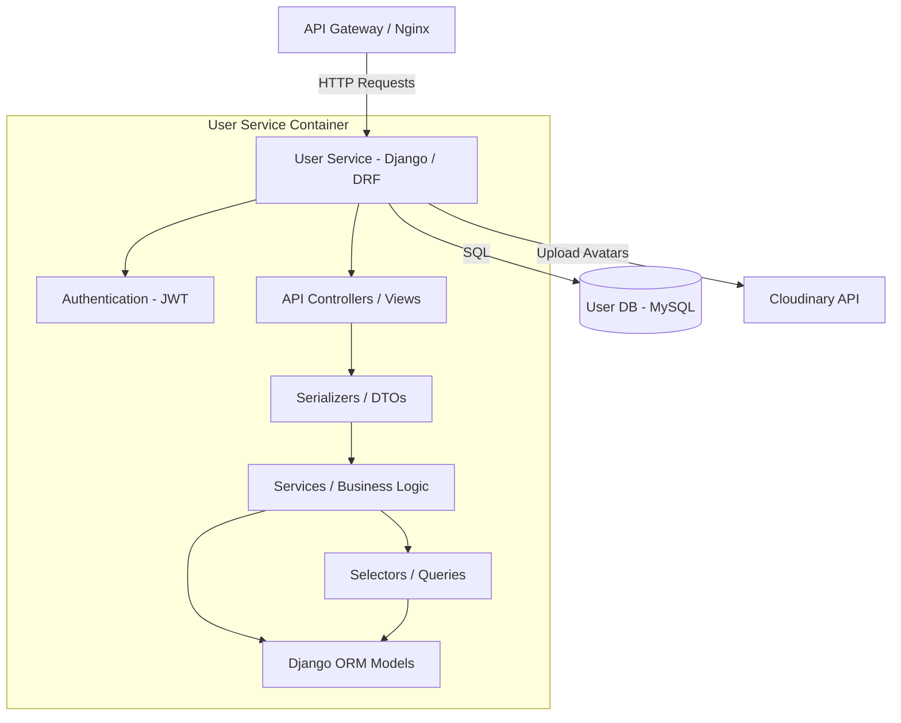
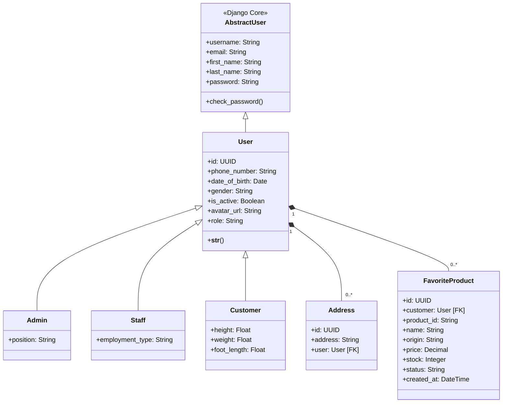

# User Service

Dịch vụ quản lý người dùng (User Service) chịu trách nhiệm xác thực, phân quyền và lưu trữ thông tin cá nhân của các đối tượng trong hệ thống e-commerce như Khách hàng (Customer), Nhân viên (Staff), và Quản trị viên (Admin).

---

## 1. Công nghệ sử dụng (Tech Stack)

- **Ngôn ngữ:** Python 3.10+
- **Framework:** Django 4.2+ & Django REST Framework (DRF) 3.15+
- **Xác thực:** JWT (JSON Web Token) qua thư viện `djangorestframework-simplejwt`
- **Cơ sở dữ liệu:** MySQL 8.0
- **Lưu trữ media:** Cloudinary (lưu trữ ảnh đại diện/avatar của người dùng)

---

## 2. Thiết kế hệ thống (System Design)

### 2.1. Biểu đồ Use Case (Use Case Diagram)

Dưới đây là sơ đồ mô tả các chức năng cốt lõi của hệ thống dành cho từng nhóm tác nhân (Guest, Customer, Staff, Admin):

```mermaid
leftToRightDirection
actor Guest as "Khách vãng lai (Guest)"
actor Customer as "Khách hàng (Customer)"
actor Staff as "Nhân viên (Staff)"
actor Admin as "Quản trị viên (Admin)"

rectangle "User Service System" {
  usecase UC_Register as "Đăng ký tài khoản"
  usecase UC_Login as "Đăng nhập (Nhận JWT)"
  usecase UC_RefreshToken as "Làm mới JWT Token"
  usecase UC_GetProfile as "Xem hồ sơ cá nhân"
  usecase UC_UpdateProfile as "Cập nhật hồ sơ & Avatar"
  usecase UC_ManageAddress as "Quản lý sổ địa chỉ"
  usecase UC_ManageFavorites as "Quản lý sản phẩm yêu thích"
  usecase UC_ViewUsers as "Xem danh sách người dùng"
  usecase UC_ManageUsers as "Quản trị tài khoản (CRUD)"
}

Guest --> UC_Register
Guest --> UC_Login

Customer --> UC_Login
Customer --> UC_RefreshToken
Customer --> UC_GetProfile
Customer --> UC_UpdateProfile
Customer --> UC_ManageAddress
Customer --> UC_ManageFavorites

Staff --> UC_Login
Staff --> UC_RefreshToken
Staff --> UC_GetProfile
Staff --> UC_UpdateProfile
Staff --> UC_ViewUsers

Admin --> UC_Login
Admin --> UC_RefreshToken
Admin --> UC_GetProfile
Admin --> UC_UpdateProfile
Admin --> UC_ViewUsers
Admin --> UC_ManageUsers
```

---

### 2.2. Biểu đồ Thành phần (Component Diagram)

Kiến trúc bên trong User Service được tổ chức theo mô hình phân lớp (Layered Architecture):



---

### 2.3. Biểu đồ Lớp (Class Diagram)

Cấu trúc các lớp thực thể trong User Service (kế thừa từ lớp User mặc định của Django):



---

### 2.4. Mô hình Dữ liệu (Data Model)

Hệ thống sử dụng cơ sở dữ liệu quan hệ MySQL với thiết kế Multi-table Inheritance (kế thừa nhiều bảng) của Django ORM để mô tả các loại người dùng.

#### Bảng `users_user` (Thông tin tài khoản chung)
| Trường | Kiểu dữ liệu | Ràng buộc | Mô tả |
| :--- | :--- | :--- | :--- |
| `id` | UUID (char(36)) | Primary Key | Khóa chính tự sinh |
| `username` | varchar(150) | Unique, Not Null | Tên đăng nhập |
| `password` | varchar(128) | Not Null | Mật khẩu đã băm |
| `email` | varchar(254) | Not Null | Địa chỉ email |
| `phone_number`| varchar(10) | Not Null | Số điện thoại |
| `date_of_birth`| date | Nullable | Ngày sinh |
| `gender` | varchar(10) | Choices: `male`, `female`, `other` | Giới tính |
| `is_active` | boolean | Default: `True` | Trạng thái kích hoạt |
| `avatar_url` | varchar(500) | Nullable | Đường dẫn ảnh đại diện (Cloudinary) |
| `role` | varchar(20) | Choices: `CUSTOMER`, `STAFF`, `ADMIN` | Vai trò trong hệ thống |

#### Bảng `users_customer` (Thông tin chi tiết Khách hàng)
| Trường | Kiểu dữ liệu | Ràng buộc | Mô tả |
| :--- | :--- | :--- | :--- |
| `user_ptr_id` | UUID (char(36)) | Primary Key, Foreign Key (`users_user.id`) | Liên kết 1-1 với bảng User |
| `height` | double | Nullable | Chiều cao (cho tính năng đề xuất size) |
| `weight` | double | Nullable | Cân nặng |
| `foot_length` | double | Nullable | Chiều dài bàn chân |

#### Bảng `users_staff` (Thông tin chi tiết Nhân viên)
| Trường | Kiểu dữ liệu | Ràng buộc | Mô tả |
| :--- | :--- | :--- | :--- |
| `user_ptr_id` | UUID (char(36)) | Primary Key, Foreign Key (`users_user.id`) | Liên kết 1-1 với bảng User |
| `employment_type`| varchar(100) | Not Null | Loại hình công việc (Full-time, Part-time) |

#### Bảng `users_admin` (Thông tin chi tiết Admin)
| Trường | Kiểu dữ liệu | Ràng buộc | Mô tả |
| :--- | :--- | :--- | :--- |
| `user_ptr_id` | UUID (char(36)) | Primary Key, Foreign Key (`users_user.id`) | Liên kết 1-1 với bảng User |
| `position` | varchar(100) | Not Null | Chức vụ điều hành |

#### Bảng `users_address` (Sổ địa chỉ khách hàng)
| Trường | Kiểu dữ liệu | Ràng buộc | Mô tả |
| :--- | :--- | :--- | :--- |
| `id` | UUID (char(36)) | Primary Key | Khóa chính tự sinh |
| `address` | varchar(500) | Not Null | Địa chỉ chi tiết |
| `user_id` | UUID (char(36)) | Foreign Key (`users_user.id`), Cascade | Liên kết tới User sở hữu địa chỉ |

#### Bảng `users_favoriteproduct` (Danh sách sản phẩm yêu thích)
| Trường | Kiểu dữ liệu | Ràng buộc | Mô tả |
| :--- | :--- | :--- | :--- |
| `id` | UUID (char(36)) | Primary Key | Khóa chính tự sinh |
| `customer_id` | UUID (char(36)) | Foreign Key (`users_user.id`), Cascade | Khách hàng thích sản phẩm |
| `product_id` | varchar(100) | Not Null, Index | ID của sản phẩm (từ Product Service) |
| `name` | varchar(255) | Nullable | Tên sản phẩm tại thời điểm lưu |
| `origin` | varchar(255) | Nullable | Xuất xứ sản phẩm |
| `price` | decimal(10,2) | Nullable | Giá sản phẩm |
| `stock` | integer | Nullable | Số lượng tồn kho |
| `status` | varchar(20) | Choices: `NEW`, `SELLING`, `OUT_OF_STOCK`, `DISCONTINUED` | Trạng thái sản phẩm |
| `created_at` | datetime | Auto Now Add | Thời gian thêm vào danh sách |

- *Lưu ý:* Có ràng buộc unique kết hợp `UniqueConstraint(fields=["customer", "product_id"])` đảm bảo một khách hàng không thể thêm trùng lặp một sản phẩm vào mục yêu thích.

---

## 3. Danh sách API (API Specification)

Chi tiết các Endpoint, đặc tả Request Body, Response mẫu và phân quyền truy cập của User Service được tài liệu hóa riêng biệt tại:

👉 **[Tài liệu API dạng Markdown (API_DOCUMENTATION.md)](API_DOCUMENTATION.md)**

👉 **[Tài liệu OpenAPI Spec dạng YAML (openapi.yaml)](openapi.yaml)**

---

## 4. Quản trị & Vận hành

### 4.1. Hướng dẫn Seed dữ liệu (Database Seeding)

User Service hỗ trợ seed dữ liệu mẫu nhanh chóng thông qua lệnh quản trị Django tùy chỉnh:

#### Cách 1: Tự động chạy khi khởi động hệ thống
Trong tệp cấu hình `docker-compose.yml`, biến môi trường `USER_SEED_ON_STARTUP=1` đã được thiết lập sẵn cho container `user-service`. Hệ thống sẽ tự động thực hiện quá trình seed dữ liệu từ file dữ liệu thô `seeds/data_raw/users.csv` ngay khi container bắt đầu hoạt động.

#### Cách 2: Seed dữ liệu thủ công bằng Script shell
Từ thư mục gốc của dự án (repository root), bạn chạy lệnh sau:
```bash
./user-service/scripts/seed_users.sh
```

#### Cách 3: Chạy trực tiếp qua Docker Command
Nếu muốn chạy trực tiếp lệnh quản trị Django bên trong container:
```bash
docker compose -f infrastructure/docker-compose.yml exec user-service python manage.py seed_users
```

---

### 4.2. Xem logs của User Service

Để theo dõi log hoạt động (Request/Response, SQL query hoặc lỗi runtime) của User Service, chạy lệnh sau từ thư mục gốc:

```bash
docker compose -f infrastructure/docker-compose.yml logs -f user-service
```

Nếu muốn theo dõi log của cơ sở dữ liệu MySQL đi kèm (`user-db`):
```bash
docker compose -f infrastructure/docker-compose.yml logs -f user-db
```

---

## Copyright

Dự án này được nghiên cứu và phát triển bởi **Hana** phục vụ mục đích học tập, trình diễn kỹ thuật và phỏng vấn.
