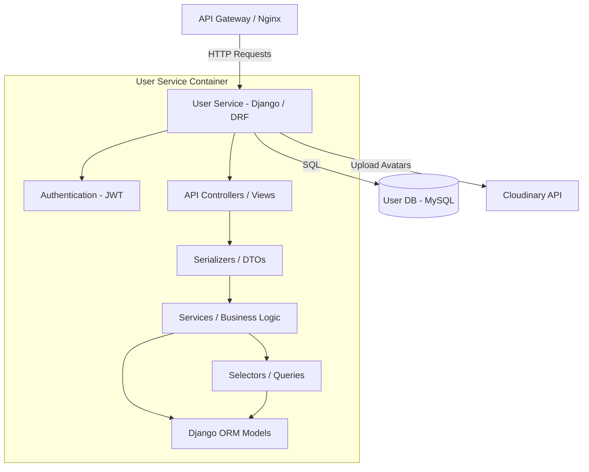
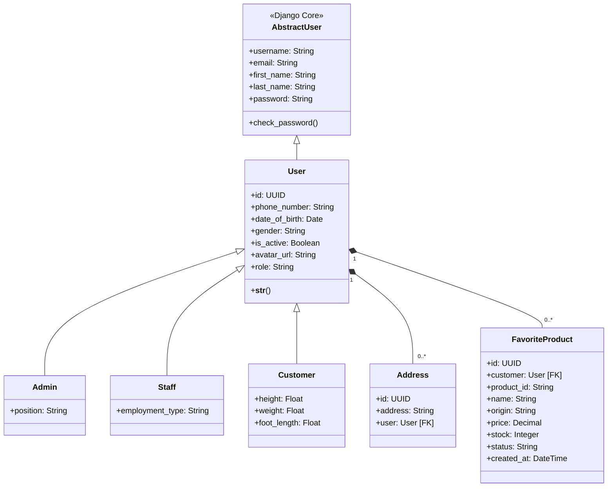

# User Service

The User Service is responsible for user authentication, authorization, and storing personal profile details for different roles in the e-commerce system: Customers, Staff, and Admins.

---

## 1. Tech Stack

- **Language:** Python 3.10+
- **Framework:** Django 4.2+ & Django REST Framework (DRF) 3.15+
- **Authentication:** JWT (JSON Web Token) via `djangorestframework-simplejwt`
- **Database:** MySQL 8.0
- **Media Storage:** Cloudinary (for storing user avatars/images)

---

## 2. System Design

### 2.1. Core Features & Responsibilities

The User Service handles the following core functionalities:

- **Authentication & Token Management:**
  - Guest registration (`CUSTOMER` role).
  - Secure login issuing JWT Access and Refresh tokens.
  - Session termination (Logout) by blacklisting the Refresh Token.
  - Standard secure password hashing using Django default PBKDF2/bcrypt.
- **Role-Based Access Control (RBAC):**
  - Fine-grained permission system distinguishing `CUSTOMER`, `STAFF`, and `ADMIN` users.
- **Profile Management:**
  - Retrieve and update general information (names, email, phone number, gender, date of birth).
  - Save body measurements (height, weight, foot length) to support shoe/clothing size recommendation algorithms.
  - Upload and link avatar images powered by Cloudinary.
- **Address Book Management:**
  - Full CRUD operations (Create, Read, Update, Delete) on shipping addresses, which integrate directly with checkout workflows.
- **Favorite Products Listing:**
  - Let customers save and unsave items to a personalized favorites directory.
- **Administrative Control (Admin-only):**
  - Full CRUD access to view, update, and manage accounts of customers, staff, and admins.

---

### 2.2. Component Diagram

The internal structure of the User Service is designed following a layered architecture:



---

### 2.3. Class Diagram

The domain model classes in User Service inherit from Django's core authentication model:



---

### 2.4. Data Model

The database is built on MySQL using Django's Multi-table Inheritance to support different user roles.

#### Table `users_user` (Shared Account Credentials & Profile)
| Field | Data Type | Constraint | Description |
| :--- | :--- | :--- | :--- |
| `id` | UUID (char(36)) | Primary Key | Auto-generated UUID |
| `username` | varchar(150) | Unique, Not Null | Account username |
| `password` | varchar(128) | Not Null | Hashed password |
| `email` | varchar(254) | Not Null | Email address |
| `phone_number`| varchar(10) | Not Null | Phone number |
| `date_of_birth`| date | Nullable | Date of birth |
| `gender` | varchar(10) | Choices: `male`, `female`, `other` | Gender |
| `is_active` | boolean | Default: `True` | Account status |
| `avatar_url` | varchar(500) | Nullable | Avatar image URL (stored in Cloudinary) |
| `role` | varchar(20) | Choices: `CUSTOMER`, `STAFF`, `ADMIN` | System permission role |

#### Table `users_customer` (Customer-specific Profile Details)
| Field | Data Type | Constraint | Description |
| :--- | :--- | :--- | :--- |
| `user_ptr_id` | UUID (char(36)) | Primary Key, FK (`users_user.id`) | One-to-One link to User table |
| `height` | double | Nullable | Height (used for sizing recommendations) |
| `weight` | double | Nullable | Weight |
| `foot_length` | double | Nullable | Foot length (used for sizing recommendations) |

#### Table `users_staff` (Staff-specific Details)
| Field | Data Type | Constraint | Description |
| :--- | :--- | :--- | :--- |
| `user_ptr_id` | UUID (char(36)) | Primary Key, FK (`users_user.id`) | One-to-One link to User table |
| `employment_type`| varchar(100) | Not Null | Employment contract type (Full-time, Part-time) |

#### Table `users_admin` (Admin-specific Details)
| Field | Data Type | Constraint | Description |
| :--- | :--- | :--- | :--- |
| `user_ptr_id` | UUID (char(36)) | Primary Key, FK (`users_user.id`) | One-to-One link to User table |
| `position` | varchar(100) | Not Null | Administrative position |

#### Table `users_address` (Saved Shipping Addresses)
| Field | Data Type | Constraint | Description |
| :--- | :--- | :--- | :--- |
| `id` | UUID (char(36)) | Primary Key | Auto-generated UUID |
| `address` | varchar(500) | Not Null | Detailed address string |
| `user_id` | UUID (char(36)) | FK (`users_user.id`), Cascade | Owner of the address |

#### Table `users_favoriteproduct` (Customer Favorite Products)
| Field | Data Type | Constraint | Description |
| :--- | :--- | :--- | :--- |
| `id` | UUID (char(36)) | Primary Key | Auto-generated UUID |
| `customer_id` | UUID (char(36)) | FK (`users_user.id`), Cascade | Customer who favorited the product |
| `product_id` | varchar(100) | Not Null, Index | Product ID referencing Product Service |
| `name` | varchar(255) | Nullable | Product name at the time of favoriting |
| `origin` | varchar(255) | Nullable | Country of origin |
| `price` | decimal(10,2) | Nullable | Product price |
| `stock` | integer | Nullable | Stock quantity |
| `status` | varchar(20) | Choices: `NEW`, `SELLING`, `OUT_OF_STOCK`, `DISCONTINUED` | Product status |
| `created_at` | datetime | Auto Now Add | Record creation timestamp |

- *Note:* A unique constraint `UniqueConstraint(fields=["customer", "product_id"])` prevents a customer from saving the same product to their favorites list multiple times.

---

## 3. API Specification

All request endpoints, request body structure, response schemas, and authorization levels for User Service are documented separately:

👉 **[OpenAPI Spec - YAML (docs/openapi.yaml)](docs/openapi.yaml)**

---

## 4. Administration & Operation

### 4.1. Database Seeding

The User Service supports database seeding for development/testing via a custom Django management command:

#### Method 1: Automatic Seeding on Startup
Inside `docker-compose.yml`, the environment variable `USER_SEED_ON_STARTUP=1` is preset for the `user-service` container. It automatically seeds default users from `seeds/data_raw/users.csv` during container setup.

#### Method 2: Manual Script Execution
From the repository root directory, run:
```bash
./user-service/scripts/seed_users.sh
```

#### Method 3: Direct Docker Compose Exec
Run the Django management command directly inside the active container:
```bash
docker compose -f infrastructure/docker-compose.yml exec user-service python manage.py seed_users
```

---

### 4.2. Viewing Logs

To track application behavior, SQL queries, or runtime errors in the User Service, run from the repository root:

```bash
docker compose -f infrastructure/docker-compose.yml logs -f user-service
```

To view the database container logs (`user-db`):
```bash
docker compose -f infrastructure/docker-compose.yml logs -f user-db
```

---

## Copyright

This project was researched and developed by **Hana** for learning, technical demonstration, and interviewing purposes.
